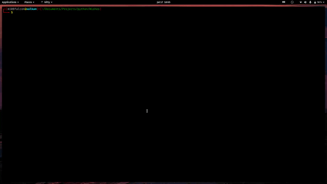

# Wishes

The Pyhton Script was created because I wanted to wish my father in my style(Inspiration from [Engineer Man](https://github.com/engineer-man))  
The script uses threads and mutex locks to get the desired result.  
**Requirements:** None! Just basic python install  
**PS:** I have also included other wishes in the same ASCII art font.   
just add R, G, B, Y in the txt files to print red, green, blue, yellow and replace the name of text file inside the [python script](happy_Birthday.py) on Line 10.
